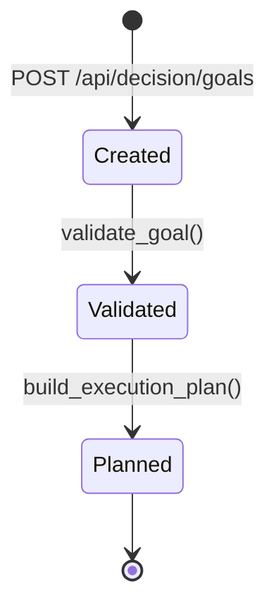
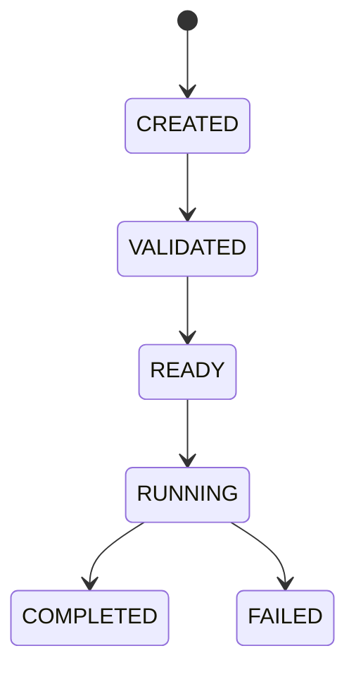

# Decision Engine

The Decision Engine is a deterministic rule-based planning layer. It converts
high-level building goals into ordered simulation execution plans. It is not an
AI system and does not use LLMs, MCP, autonomous reasoning, reinforcement
learning, or optimization algorithms.

## Architecture

```text
Supervisor (future)
    ↓
AI Planner (future)
    ↓
Decision Engine
    ↓
Simulation Orchestrator
    ↓
Simulation Controller
    ↓
SimulationAdapter
    ↓
EnergyPlusAdapter
    ↓
EnergyPlusRuntime
```

The Decision Engine only creates and manages plans through the Simulation
Orchestrator. It never bypasses `SimulationAdapter`.

## Goal Lifecycle



Supported `GoalType` values:

- `ENERGY_REDUCTION`
- `PEAK_LOAD`
- `THERMAL_COMFORT`
- `HVAC`
- `LIGHTING`
- `OCCUPANCY`
- `CARBON`
- `WATER`
- `DIAGNOSTICS`

## Plan Lifecycle



Generated plans contain ordered simulation job ids in `execution_order`.

## Rule Engine

Rules are explicit scenario sequences. Examples:

Energy reduction:

```text
baseline
↓
reduced_hvac
↓
reduced_lighting
↓
result_comparison
```

Thermal comfort:

```text
baseline
↓
occupancy_simulation
↓
hvac_adjustment
↓
result_comparison
```

Diagnostics:

```text
baseline
↓
equipment_analysis
↓
fault_detection
```

## Execution Flow

1. A client creates a `DecisionGoal`.
2. The Decision Engine validates the goal and constraints.
3. The deterministic rule table selects ordered scenarios.
4. The engine creates simulation jobs through `SimulationOrchestrator`.
5. An `ExecutionPlan` records job ids, execution order, status, and estimated runtime.
6. Future planners or supervisors can submit the plan for execution.

## REST API

```text
POST /api/decision/goals
GET /api/decision/goals
GET /api/decision/goals/{id}
POST /api/decision/goals/{id}/plan
GET /api/decision/plans/{id}
```

## Error Handling

The engine handles:

- unknown goals
- invalid constraints
- duplicate goals
- plan generation failure
- missing execution plans
- invalid execution state
