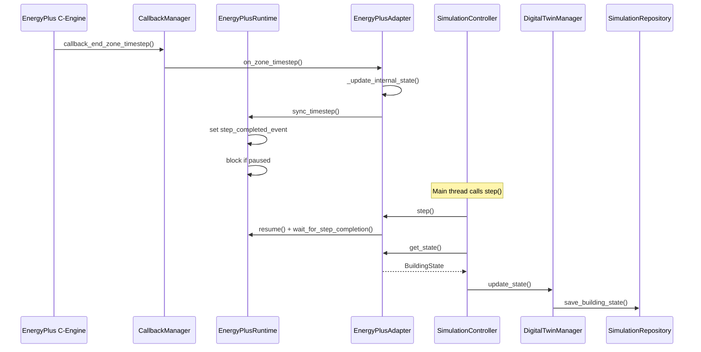

# EnergyPlus Integration Design

EnergyPlus is the industry-standard building energy simulation program. IntelliBuild AI treats EnergyPlus as the physical truth of the virtual building.

## The Adapter Layer

To ensure IntelliBuild AI is not hard-coupled to the specifics of PyEnergyPlus or the EnergyPlus CLI, all simulation interactions occur through the `SimulationAdapter` ABC.

**Responsibilities of the Adapter:**
- Initialize the `.idf` and weather `.epw` files.
- Bridge API calls into PyEnergyPlus API callbacks.
- Map internal EnergyPlus handles (actuators, meters, variables) into our strongly-typed Pydantic schemas (`SensorData`, `BuildingState`).
- Map our outgoing `ControlAction` models back into EnergyPlus actuator overrides.

## Concrete Implementation: `EnergyPlusAdapter`

The `EnergyPlusAdapter` class is the production concrete implementation of `SimulationAdapter`. It is composed of several internal modules:

| Module | Responsibility |
|---|---|
| `configuration.py` | `EnergyPlusConfig` (Pydantic): EnergyPlus path, IDF path, EPW path, output dir, timeout. Overridable via `EPLUS_` env vars. |
| `idf_loader.py` | Validates that the IDF file exists before engine launch. |
| `weather.py` | `WeatherManager`: validates that the EPW weather file exists before engine launch. |
| `output_manager.py` | Manages the output directory and constructs CLI args (`-d`) for EnergyPlus output routing. |
| `callbacks.py` | `CallbackManager`: Registers `callback_end_zone_timestep_after_zone_reporting` with the C-API. On each zone timestep, pulls variable state and synchronizes with the runtime thread. |
| `runtime.py` | `EnergyPlusRuntime`: Runs `run_energyplus()` in a dedicated background daemon thread. Exposes `pause()`, `resume()`, `stop()`, and `sync_timestep()` via `threading.Condition` and `threading.Event`. |
| `errors.py` | Custom exceptions: `EnergyPlusError`, `MissingIDFError`, `MissingWeatherError`, `EnergyPlusRuntimeError`, `CallbackError`. |

### Weather Validation Public API

```python
from app.energyplus.weather import WeatherManager

manager = WeatherManager()
manager.validate("weather.epw")
```

`WeatherManager.validate()` raises `MissingWeatherError` when the EPW file does not exist or the path is not a file.

## Callback Flow



## Expected Runtime Lifecycle

1. **Pre-Warm**: The application spins up, parses the IDF.
2. **Lockstep Execution**: The engine does not run freely. It advances strictly tick-by-tick (e.g., 5-minute intervals) commanded by the `SimulationController.step()` method.
3. **Data Pull**: At the end of a tick, variables are read and mapped to the Digital Twin.
4. **Action Push**: If the AI evaluated an action during the step, the actuator override is applied immediately before the subsequent step begins.

## Folder Structure

```text
app/energyplus/
├── __init__.py
├── callbacks.py           # PyEnergyPlus callback registration
├── configuration.py       # EnergyPlusConfig (Pydantic)
├── digital_twin.py        # DigitalTwinManager
├── energyplus_adapter.py  # Concrete SimulationAdapter
├── errors.py              # Custom exceptions
├── idf_loader.py          # IDF file validation
├── interfaces.py          # SimulationAdapter ABC
├── output_manager.py      # Output directory management
├── repository.py          # SimulationRepository
├── runtime.py             # Background thread engine
├── simulation_controller.py
├── simulation_state.py    # Pydantic state models
└── weather.py             # WeatherManager EPW file validation
```
