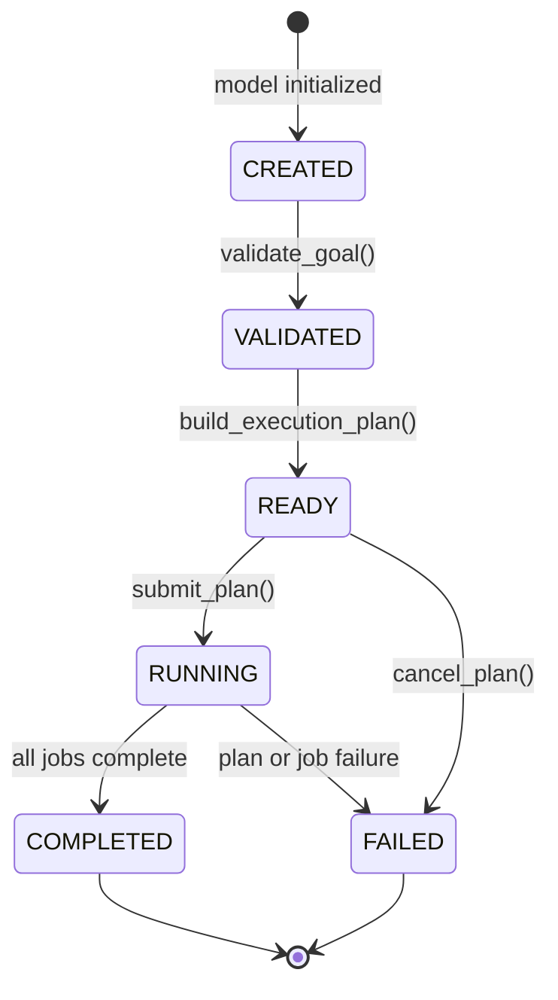
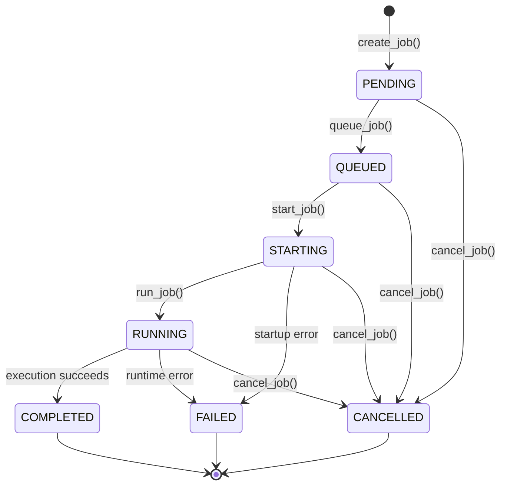
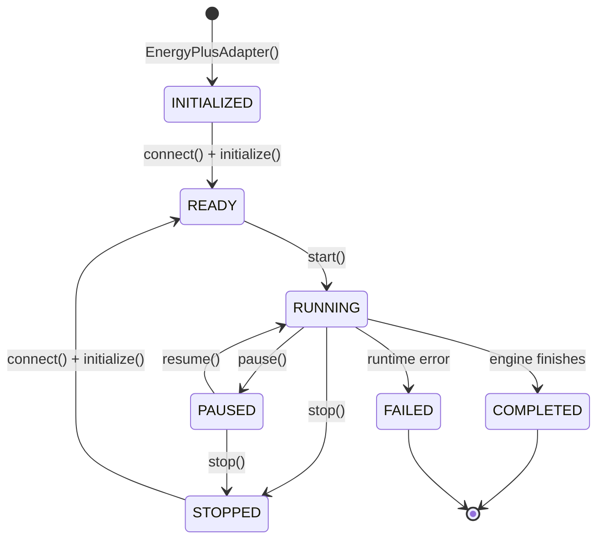

# Simulation Lifecycle

The simulation engine follows a rigid state machine to guarantee deterministic physics execution and AI synchronization.

Simulation job execution is owned by the `SimulationOrchestrator`. Job state is separate from the lower-level EnergyPlus engine state, but all execution still flows through `SimulationController` and `SimulationAdapter`.

Decision planning happens above simulation job execution. The `DecisionEngine`
converts a validated goal into an ordered execution plan, then asks the
`SimulationOrchestrator` to create the required simulation jobs.

## Decision Plan State Machine

## Job State Machine

The API returns immediately after scheduling a job. Background execution updates timestamps, progress, terminal status, error details, output directory, and any captured simulation snapshot.

## State Machine

## Phases

### 1. Initialization
- **Action**: `EnergyPlusAdapter` is instantiated. Configuration is loaded from environment variables prefixed with `EPLUS_`.
- **State**: `SimulationStatus.INITIALIZED`

### 2. Connect & Ready
- **Action**: `connect()` loads the PyEnergyPlus DLL/SO and allocates a C-level state. `initialize()` validates IDF/EPW files, prepares the output directory, creates the `EnergyPlusRuntime` thread wrapper, and registers callbacks via `CallbackManager`.
- **State**: `SimulationStatus.READY`

### 3. Start
- **Action**: `start()` launches the EnergyPlus C-engine in a dedicated daemon thread via `EnergyPlusRuntime.start()`. The engine begins its warmup period and enters the timestep loop.
- **State**: `SimulationStatus.RUNNING`

### 4. Step
- **Action**: The core tick. `step()` resumes the background engine thread, waits for `sync_timestep()` to fire from the callback, then pauses the engine again. After a step completes, the `SimulationController` pulls state and sensor data into the Digital Twin.

### 5. Pause
- **Action**: Engine execution halts indefinitely at the next sync point. State remains in memory. AI can query the Twin but cannot advance time.
- **State**: `SimulationStatus.PAUSED`

### 6. Resume
- **Action**: Engine lock is released. Normal stepping resumes.
- **State**: `SimulationStatus.RUNNING`

### 7. Stop
- **Action**: Simulation is aborted gracefully. The runtime thread is signaled to exit.
- **State**: `SimulationStatus.STOPPED`

### 8. Restart
- **Action**: Calls `stop()`, then re-runs `connect()`, `initialize()`, and `start()` to begin from time 0.
- **State**: `STOPPED` → `READY` → `RUNNING`

### 9. Completed
- **Action**: The EnergyPlus engine reaches the end of the simulation period and exits naturally with code 0.
- **State**: `SimulationStatus.COMPLETED`

### 10. Failed
- **Action**: The EnergyPlus engine encounters a fatal error (non-zero exit code, C-level crash, or callback exception).
- **State**: `SimulationStatus.FAILED`

### 11. Shutdown
- **Action**: Full teardown. Calls `stop()` then `disconnect()`, which deletes the C-level state and releases all handles.
