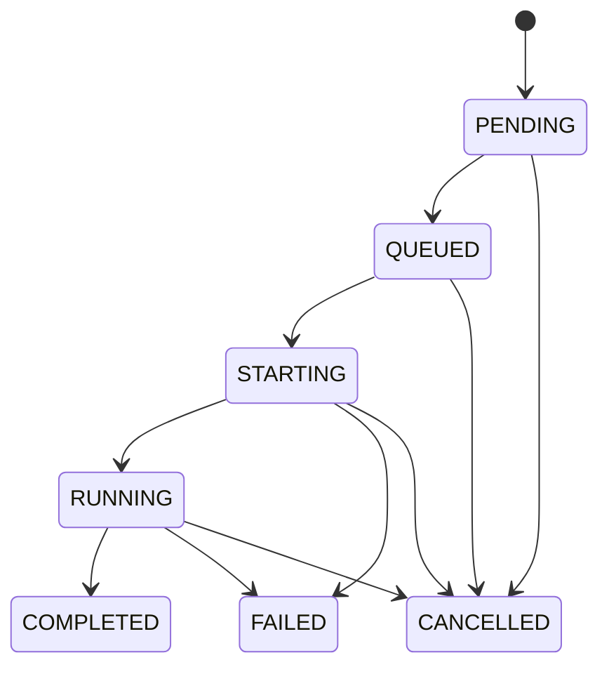

# Simulation Orchestrator

The Simulation Orchestrator is the non-AI execution layer for simulation jobs.
It creates, queues, starts, monitors, cancels, and records simulation execution
metadata independently of any LLM or autonomous decision system.

## Responsibilities

- Create simulation jobs with scenario metadata.
- Queue jobs before execution.
- Start jobs through asynchronous background tasks.
- Execute simulations through `SimulationController`.
- Preserve the `SimulationAdapter` boundary.
- Track timestamps, duration, status, progress, errors, output directories, and captured simulation state.
- Provide job status through FastAPI.

## Architecture Boundary

The orchestrator does not talk to EnergyPlus directly.

```text
SimulationOrchestrator
    ↓
SimulationController
    ↓
SimulationAdapter
    ↓
EnergyPlusAdapter
    ↓
EnergyPlusRuntime
```

AI components will call the orchestration layer in later milestones, but
Milestone 4 introduces no LLMs, MCP, reinforcement learning, or optimization.

## Job Model

`SimulationJob` fields:

- `id`
- `twin_id`
- `scenario_name`
- `status`
- `created_at`
- `started_at`
- `completed_at`
- `progress`
- `simulation_state`
- `error_message`
- `output_directory`
- `duration_seconds`

## State Machine



Terminal states are `COMPLETED`, `FAILED`, and `CANCELLED`.

## REST API

```text
POST /api/simulations
GET /api/simulations
GET /api/simulations/{id}
POST /api/simulations/{id}/start
POST /api/simulations/{id}/cancel
```

`POST /api/simulations/{id}/start` schedules background execution and returns
without blocking the HTTP request.

## Execution Flow

1. Client creates a job with `POST /api/simulations`.
2. Client starts the job with `POST /api/simulations/{id}/start`.
3. The API transitions the job through `PENDING -> QUEUED -> STARTING`.
4. `TaskScheduler` schedules `SimulationOrchestrator.run_job()`.
5. The orchestrator transitions `STARTING -> RUNNING`.
6. The simulation is executed through `SimulationController`.
7. The orchestrator records completion, failure, or cancellation metadata.

## Error Handling

The orchestrator handles:

- duplicate jobs
- missing jobs
- invalid state transitions
- failed simulation execution
- cancellation
- unexpected runtime exceptions
